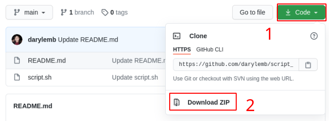
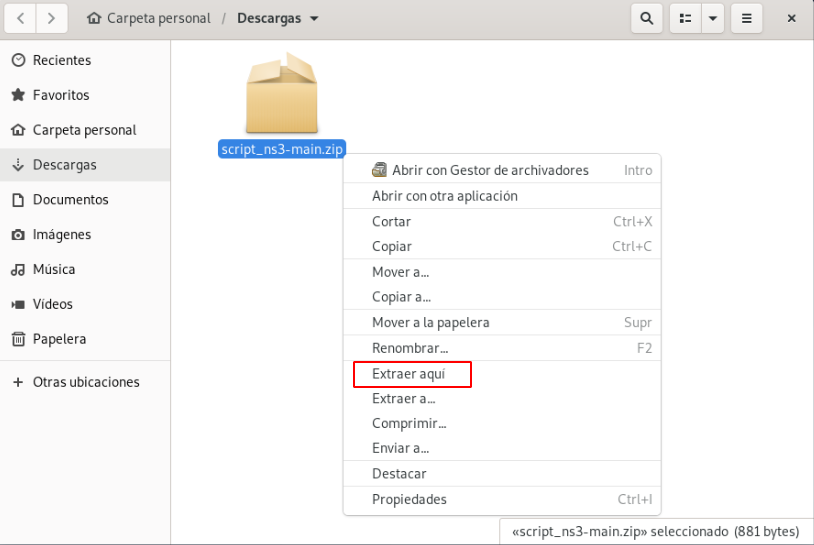
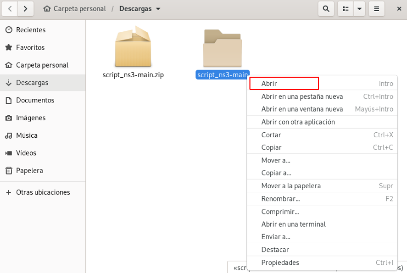
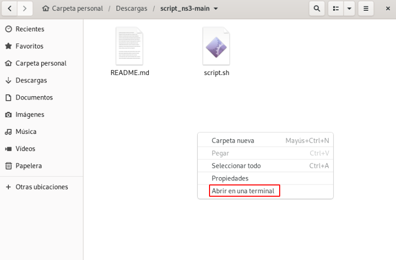
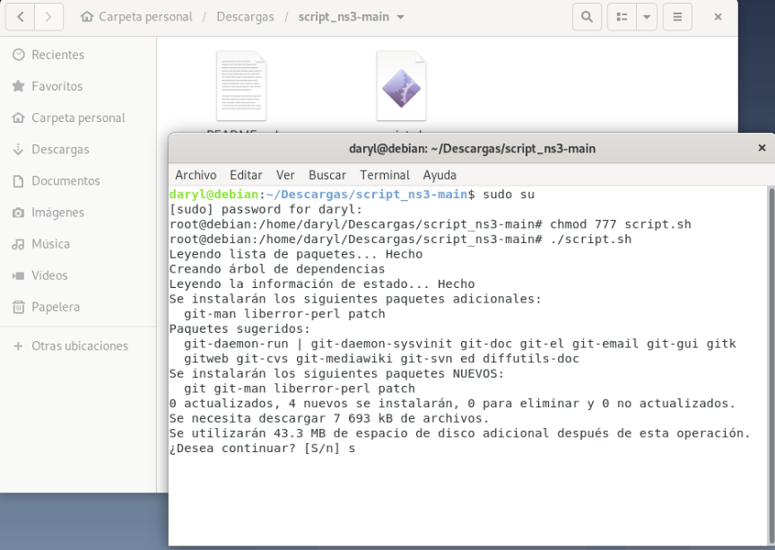
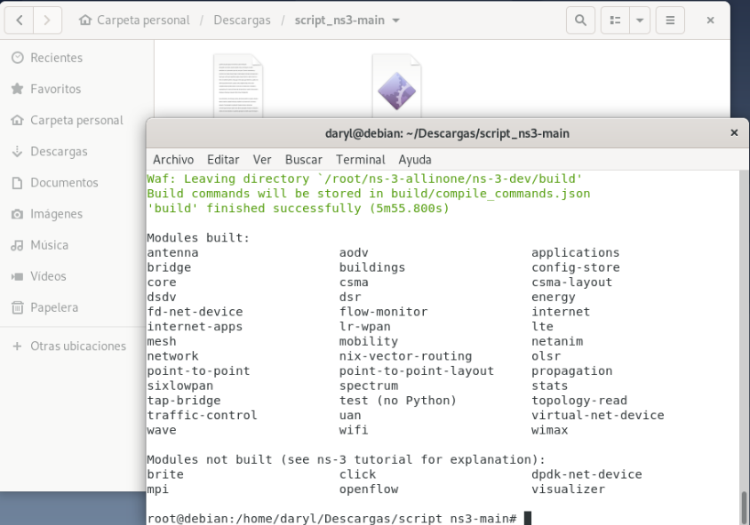

# INSTRUCCIONES

**DESCARGAR EL ARCHIVO, DESCOMPRIMIRLO Y EN UNA TERMINAL ABIERTA EN LA CARPETA DONDE SE ENCUENTRA EL ARCHIVO script.sh ESCRIBIR LO SIGUIENTE:**\
sudo su\
chmod 777 script.sh\
./script.sh

**Instrucciones visuales**\
\
\
Descargar el proyecto completo:\

 \
 \
Descomprimir el proyecto:\

\
\
Abrir la carpeta descomprimida:\

\
\
Abrir terminal dentro de la carpeta:\

\
\
Escribir las instrucciones siguientes en la terminal:\
sudo su\
chmod 777 script.sh\
./script.sh\
\
\

\
Escribir S si llega a solcitar permisos de instalación (como en la imagen superior).\
Al finalizar el script se visualiza lo siguiente:\

